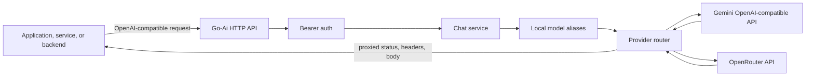
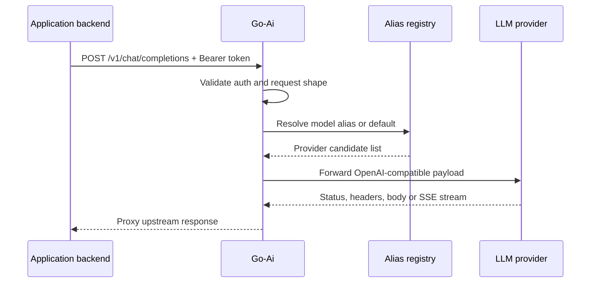
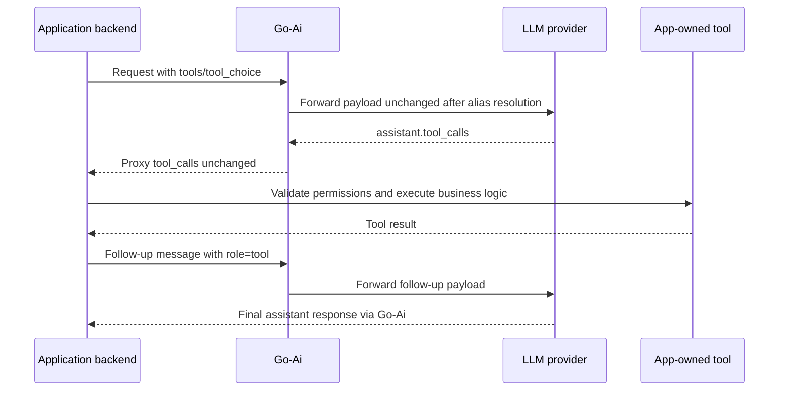
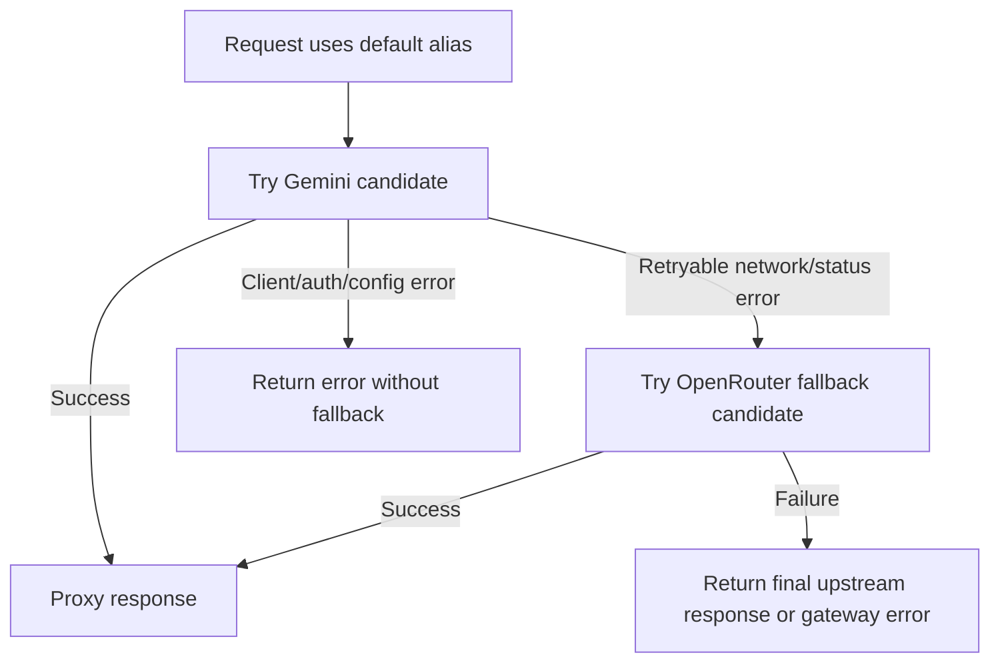

# Go-Ai

[](https://github.com/JakuninOleg/Go-Ai/actions/workflows/ci.yml)
[](https://github.com/JakuninOleg/Go-Ai/actions/workflows/fly-deploy.yml)
[](LICENSE)
[](go.mod)

Go-Ai is a small OpenAI-compatible AI gateway written in Go for applications and services. It exposes a familiar `/v1/chat/completions` endpoint, keeps provider secrets behind your backend, resolves local model aliases, and proxies requests to upstream LLM providers.

The current MVP uses Gemini as the default provider, can fall back to OpenRouter for retryable failures, supports HTTP/SSE streaming pass-through, and keeps tool execution in the application layer where business context belongs.

v0.1 intentionally starts with Gemini and OpenRouter only: Gemini is the default provider this gateway was built around, and OpenRouter gives a broad fallback/aggregator path through one OpenAI-compatible API. See [Adding models and providers](docs/adding-models.md) for the extension path and caveats.

If you only need the minimum, call `/v1/chat/completions` from your backend with `Authorization: Bearer <GO_AI_SHARED_SECRET>`. Next.js examples are included because this repo often targets server-side web apps, but any backend or HTTP client can call Go-Ai.

## Features

- [x] OpenAI-compatible `POST /v1/chat/completions` endpoint.
- [x] Bearer auth with `GO_AI_SHARED_SECRET` for protected routes.
- [x] Local model aliases so client code does not depend on provider model slugs.
- [x] Gemini-first routing with OpenRouter fallback for retryable upstream failures.
- [x] HTTP/SSE streaming pass-through with `stream: true`.
- [x] Tool-calling payload pass-through without server-side tool execution.
- [x] In-process provider model catalog refresh with an in-memory refresh interval.
- [x] Protected model/routing status endpoint at `GET /v1/models`.
- [x] Safe stdout JSON logs, request IDs, diagnostic headers, and protected in-memory metrics at `GET /v1/status`.
- [x] Docker, Docker Compose, Fly.io, and Render deployment configuration.
- [x] CI for formatting, tests, and `go vet`.

## Architecture

For the boundary this project intentionally keeps, see [Design principles](docs/design-principles.md).



Core package boundaries:

- `cmd/api/main.go` wires configuration, providers, services, routes, and middleware.
- `internal/routes` registers public and protected HTTP routes.
- `internal/handlers` owns HTTP request/response handling, JSON errors, and API bearer authentication.
- `internal/services` parses OpenAI-style chat requests, resolves aliases, and selects providers.
- `internal/models` contains the local model registry.
- `internal/providers` contains provider clients for Gemini and OpenRouter.

## Request flow



## Quick start

### Prerequisites

- Go version compatible with [`go.mod`](go.mod).
- A Gemini API key for the default route.
- Optional OpenRouter API key for fallback models.

### Configure

```sh
cp .env.example .env
```

Edit `.env` with local secrets:

```dotenv
PORT=8080
GO_AI_SHARED_SECRET=change-me
GEMINI_API_KEY=your-gemini-key
GEMINI_BASE_URL=https://generativelanguage.googleapis.com/v1beta/openai
OPENROUTER_API_KEY=
OPENROUTER_BASE_URL=https://openrouter.ai/api/v1
MODEL_REFRESH_INTERVAL=1h
```

Do not commit `.env` or real secret values.

### Validate and run

```sh
go test ./...
go run ./cmd/api
```

## Minimal HTTP integration

Use this shape from trusted server-side code: a backend route, worker, CLI, or internal service. Do not put `GO_AI_SHARED_SECRET` in browser code.

Health check:

```sh
curl http://localhost:8080/health
```

Chat request:

```sh
curl http://localhost:8080/v1/chat/completions \
  -H "Authorization: Bearer <GO_AI_SHARED_SECRET>" \
  -H "Content-Type: application/json" \
  -d '{
    "messages": [
      { "role": "user", "content": "Say hello in one sentence." }
    ]
  }'
```

If `model` is omitted, Go-Ai uses the default local alias.

Tiny TypeScript helper:

```ts
type ChatMessage = {
  role: "system" | "user" | "assistant" | "tool";
  content: string | null;
};

export async function askGoAi(messages: ChatMessage[]) {
  const baseUrl = process.env.GO_AI_BASE_URL ?? "http://localhost:8080";
  const sharedSecret = process.env.GO_AI_SHARED_SECRET;

  if (!sharedSecret) {
    throw new Error("GO_AI_SHARED_SECRET is required");
  }

  const response = await fetch(`${baseUrl}/v1/chat/completions`, {
    method: "POST",
    headers: {
      "Content-Type": "application/json",
      Authorization: `Bearer ${sharedSecret}`,
    },
    body: JSON.stringify({ messages }),
  });

  return response.json();
}
```

For a copyable minimal helper, see [examples/minimal-http-client](examples/minimal-http-client). For an advanced Next.js route-handler example with streaming and a tool-calling skeleton, see [examples/next-route-handler](examples/next-route-handler).

## Using Go-Ai with coding agents

Go-Ai includes concise integration guidance for coding agents such as Cursor, Claude Code, Harvi, Copilot, and similar tools. These files are meant to help an agent connect an app to Go-Ai without moving secrets or app-owned tool logic into the wrong layer:

- [`llms.txt`](llms.txt) gives a short machine-readable project context and integration rules.
- [Agent integration guide](docs/agent-integration.md) explains the HTTP contract, migration checklist, streaming, tool calling, and security boundaries.
- [Start here](docs/agent-prompts/start-here.md) explains which files to copy into another project under `docs/go-ai/` and gives one simple prompt for the coding agent.
- [Connect an app to Go-Ai](docs/agent-prompts/connect-go-ai.md) is a copy-paste prompt for minimal non-streaming integrations.
- [Migrate from Vercel AI SDK](docs/agent-prompts/migrate-from-vercel-ai-sdk.md) is a copy-paste prompt for replacing provider SDK calls with Go-Ai while preserving app UI behavior.
- [Add streaming](docs/agent-prompts/add-streaming.md) and [add tool calling](docs/agent-prompts/add-tool-calling.md) cover the two common follow-up tasks.

For another project, copy the integration pack into `docs/go-ai/`, start with `docs/agent-prompts/start-here.md`, then use the relevant connect, migrate, streaming, or tool-calling prompt.

The important boundary is the same for humans and agents: call Go-Ai from backend code, keep `GO_AI_SHARED_SECRET` server-side only, and execute product tools in the calling app.

## Documentation

- [Deploy on a VPS with Docker Compose](docs/deploy-vps.md) covers `docker-compose.yml`, `.env` setup, logs, firewall notes, and optional Caddy HTTPS.
- [Agent integration guide](docs/agent-integration.md) helps humans and coding agents connect applications to Go-Ai safely.
- [Adding models and providers](docs/adding-models.md) explains local aliases, fallback ordering, provider wiring, capability caveats, and why v0.1 stays focused on Gemini plus OpenRouter.
- [Next.js client integration](docs/next-client.md) shows server-side usage patterns, streaming, and tool-calling pass-through from a Next app.
- [Design principles](docs/design-principles.md) describes the gateway boundary and non-goals.

## Configuration

The service reads configuration from environment variables and an optional local `.env` file:

| Variable | Default | Description |
| --- | --- | --- |
| `PORT` | `8080` | HTTP port. |
| `GO_AI_SHARED_SECRET` | none | Bearer token required for protected routes. |
| `GEMINI_API_KEY` | none | Gemini provider API key. |
| `GEMINI_BASE_URL` | `https://generativelanguage.googleapis.com/v1beta/openai` | Gemini OpenAI-compatible base URL. |
| `OPENROUTER_API_KEY` | none | OpenRouter provider API key for fallback/alternative routes. |
| `OPENROUTER_BASE_URL` | `https://openrouter.ai/api/v1` | OpenRouter OpenAI-compatible base URL. |
| `MODEL_REFRESH_INTERVAL` | `1h` | Provider model discovery refresh cadence. |

Protected routes require:

```http
Authorization: Bearer <GO_AI_SHARED_SECRET>
```

## Model aliases, fallback, and catalog refresh

Client applications should send local aliases such as `default` or omit `model` entirely. They should not depend on real provider model slugs. Go-Ai rewrites the alias to the selected upstream model before proxying the request.

The `default` alias has ordered candidates. Go-Ai tries the primary Gemini model first and can fall back to a conservative OpenRouter free candidate when the upstream failure is retryable:

- provider/network error before a response is received;
- HTTP `429`, `500`, `502`, `503`, or `504` from the upstream provider.

Go-Ai does not fall back for invalid client requests, unknown aliases, missing provider API keys, or upstream `400`, `401`, and `403` responses. If every candidate fails, the gateway returns the final upstream response when one exists, or a gateway error for network failures.

Successful chat responses include diagnostic headers:

- `X-Request-ID`
- `X-Go-Ai-Model-Alias`
- `X-Go-Ai-Provider`
- `X-Go-Ai-Upstream-Model`
- `X-Go-Ai-Fallback-Used`
- `X-Go-Ai-Duration-Ms`

Inspect model routing status:

```sh
curl http://localhost:8080/v1/models \
  -H "Authorization: Bearer <GO_AI_SHARED_SECRET>"
```

### Model catalog refresh

Go-Ai refreshes an in-memory provider model catalog on startup and then every `MODEL_REFRESH_INTERVAL` (`1h` by default). The refresh runs inside the Go-Ai process/container, so it works the same on Fly.io, Render, a VPS, or any Docker host. It does not require Redis, an external cron job, a database, or Fly scheduled jobs.

This reduces the need to constantly check provider model availability by hand. Use `GET /v1/models` to inspect the current provider catalog and routing status for the running instance.

Discovery does not replace the alias contract. Go-Ai does not blindly switch to the newest, cheapest, or first discovered model at runtime. The static alias registry remains the safe baseline for app behavior; discovery failures are logged as warnings and do not prevent the app from starting.

To add aliases, adjust fallback candidates, or wire a new provider, follow [Adding models and providers](docs/adding-models.md).

## Observability

Go-Ai writes safe structured JSON logs to stdout. On Fly.io these logs are collected by the platform and can be inspected with:

```sh
fly logs -a go-ai-i8r-lg
```

Chat completion logs include metadata such as `request_id`, method, path, status, duration, local model alias, selected provider, upstream model, fallback flag, streaming flag, and error type when applicable. They intentionally do not include request/response bodies, prompts, messages, tool arguments, `Authorization` headers, provider keys, or `.env` values.

Protected runtime metrics are available at:

```sh
curl http://localhost:8080/v1/status \
  -H "Authorization: Bearer <GO_AI_SHARED_SECRET>"
```

The response is a safe in-memory snapshot with uptime, totals for requests/successes/errors/auth failures/fallbacks/streaming requests, provider counters, status-code counters, and the last request timestamp. These metrics are per process and reset on restart; with multiple Fly machines they are not shared or persisted across machines.

## Streaming

Streaming uses HTTP/SSE pass-through on the same endpoint:

```json
{
  "model": "gemini-flash",
  "messages": [
    { "role": "user", "content": "Say hello in one short sentence." }
  ],
  "stream": true
}
```

Go-Ai does not parse or rewrite SSE chunks. It resolves the local model alias, forwards the request upstream, and proxies the upstream response body back to the caller. Fallback can happen only before Go-Ai starts proxying the upstream body; once an SSE stream is being sent, streams are not mixed or transparently replaced.

## Tool calling compatibility

Go-Ai supports tool-calling payloads as an OpenAI-compatible proxy and model router. It does not execute tools itself: tool execution stays in the calling application or service.



For the minimal HTTP example, see [examples/minimal-http-client](examples/minimal-http-client). For a Next-focused integration guide with auth, fetch examples, HTTP/SSE streaming, tool-calling flow, and voice-input guidance, see [docs/next-client.md](docs/next-client.md).

## Fallback behavior



Fallback is a resilience feature, not an availability guarantee. All providers can still be down, out of quota, misconfigured, or reject an invalid request.

## Why not LiteLLM or LangChain?

Go-Ai is not trying to replace general-purpose LLM frameworks. LiteLLM, LangChain, and similar projects are much broader tools and are often the right choice when you need their plugin ecosystems, tracing integrations, chains, agents, or provider coverage.

This project intentionally keeps a narrower boundary:

- **Small Go runtime for tiny Fly machines.** The gateway is designed as a compact HTTP service with few moving parts.
- **Direct SSE streaming path.** Streaming responses are proxied as HTTP/SSE without introducing an agent framework in the middle.
- **App-owned context and RBAC.** Applications keep user context, permissions, tenant checks, and business data access in the app layer.
- **Transparent tool-calling boundary.** Go-Ai passes tool schemas and tool calls through; application code validates and executes tools where the domain logic lives.

The tradeoff is intentional: Go-Ai provides a focused gateway layer, not a full LLM orchestration platform.

## Why only Gemini and OpenRouter in v0.1?

Provider coverage is intentionally small for the first public baseline. Gemini is the default because it is the primary provider Go-Ai was built around for personal server-side apps and has an OpenAI-compatible endpoint. OpenRouter is included as a fallback and aggregator because it can route to many models through one OpenAI-compatible API and can provide free or low-cost fallback candidates.

Keeping the provider set narrow makes the release easier to test and keeps the project honest about its scope. Go-Ai is a focused gateway, not a universal provider marketplace. More providers can be added through the documented provider interface when they have a clear use case and tests. See [Adding models and providers](docs/adding-models.md).

## Deployment

Go-Ai can be deployed with the included `Dockerfile`, `docker-compose.yml`, Fly.io config, or Render config. For a self-hosted Linux VPS, the recommended project guide is [Deploy on a VPS with Docker Compose](docs/deploy-vps.md), including the optional Caddy reverse-proxy example in [`deploy/caddy/Caddyfile.example`](deploy/caddy/Caddyfile.example).

### Docker

Build the image:

```sh
docker build -t go-ai:local .
```

Run the API locally:

```sh
docker run --rm \
  -p 8080:8080 \
  -e PORT=8080 \
  -e GO_AI_SHARED_SECRET=change-me \
  -e GEMINI_API_KEY=your-gemini-key \
  go-ai:local
```

### Deploy on a VPS with Docker Compose

Fly.io and Render are optional conveniences; Go-Ai can run on any Docker-capable host. For a simple self-hosted setup with `docker compose`, `.env` configuration, logs, firewall notes, and optional Caddy HTTPS, see [docs/deploy-vps.md](docs/deploy-vps.md).

### Fly.io

The included [`fly.toml`](fly.toml) configures a Fly app that builds from the project `Dockerfile` and serves the API on port `8080`.

My personal deployment currently runs at:

```text
https://go-ai-i8r-lg.fly.dev
```

Use it as a reference endpoint for project documentation and demos. For production applications, deploy your own instance and keep your own secrets in your deployment platform.

Runtime secrets stay in Fly, not in GitHub Actions. Configure them with Fly secrets before serving traffic:

- `GO_AI_SHARED_SECRET`
- `GEMINI_API_KEY`
- `OPENROUTER_API_KEY` if OpenRouter models are used

GitHub Actions deploys to Fly on pushes to `main` and can also be started manually from the Actions tab. To enable it, create a Fly deploy token for the app with `flyctl` or the Fly dashboard, then add it to the GitHub repository:

1. Create a deploy token scoped to `go-ai-i8r-lg`, for example with `fly tokens create deploy -a go-ai-i8r-lg`.
2. In GitHub, open repository Settings -> Secrets and variables -> Actions.
3. Add a new repository secret named `FLY_API_TOKEN` with the deploy token value.

Do not put provider API keys or `GO_AI_SHARED_SECRET` in GitHub workflows; keep those values in Fly secrets.

### Render

[`render.yaml`](render.yaml) defines a Docker-based Render web service with `/health` as the health check path. Set secret environment variables in Render before serving traffic:

- `GO_AI_SHARED_SECRET`
- `GEMINI_API_KEY`
- `OPENROUTER_API_KEY` if OpenRouter models are used

Render provides `PORT` automatically for web services, and the API already listens on that value.

## Roadmap

- Expand provider coverage while preserving local aliases.
- Consider a file/env-based alias registry after the code registry has proven too rigid for real deployments.
- Add more explicit provider health and fallback diagnostics.
- Consider shared cache/state only if multi-instance model discovery or rate limiting requires it.
- Add release/versioning guidance for public deployments.
- Keep the tool-calling boundary focused on pass-through compatibility, not server-side execution.

See the draft [v0.1.0 release notes](docs/releases/v0.1.0.md) for the current public baseline.

## Contributing and security

- See [CONTRIBUTING.md](CONTRIBUTING.md) for local checks and architecture guidelines.
- See [SECURITY.md](SECURITY.md) for vulnerability reporting and secrets handling.

## License

MIT. See [LICENSE](LICENSE).
